<div align="center">


<!-- ================= HERO ================= -->

<br/>


<br/>

[](https://git.io/typing-svg)

<p>
Computer Science Engineering student passionate about Artificial Intelligence, Software Engineering, Full-Stack Development, and Automation — building impactful software, playing chess, editing on DaVinci Resolve, and documenting the journey in fitness and content creation.
</p>

<br/>

<!-- ================= SOCIAL LINKS ================= -->

<a href="https://github.com/codesbysnehilkr">
  
</a>
<a href="https://linkedin.com/in/thatsnehilkumar">
  
</a>
<a href="https://instagram.com/encorexsnehil">
  
</a>
<a href="https://leetcode.com/u/codesbysnehilkr/">
  
</a>

<br/>
<br/>


</div>

<br/>

<!-- ================= ABOUT ME ================= -->

## &nbsp; About Me

<table>
<tr>
<td width="42%" valign="middle" align="center">

<br/>
<sub><i>// printing_profile.exe</i></sub>
</td>
<td width="58%" valign="top">

🚀&nbsp; I'm currently working on **AI applications, full-stack projects, and automation tools**.

🤝&nbsp; I'm looking to collaborate on **open-source projects, AI/ML applications, web development, and innovative tech ideas**.

🧠&nbsp; I'm currently learning **Data Structures & Algorithms, Machine Learning, System Design, Full-Stack Development, and Chess**.

💬&nbsp; Ask me about **Java, AI, Web Development, Software Engineering, Fitness, Productivity, Content Creation, or Chess**.

🎯&nbsp; **Goals for 2026:** Build impactful technology, strengthen my problem-solving skills, grow as a software engineer, and document the journey through content creation.

⚡&nbsp; **Fun fact:** My interests range from coding and chess to fitness, video editing, and content creation.

</td>
</tr>
</table>


<!-- ================= GITHUB STATS ================= -->

## &nbsp; GitHub Statistics

<table align="center" width="100%">
  <tr>
    <td align="center">
      
    </td>
    <td align="center">
      
    </td>
  </tr>
  <tr>
    <td colspan="2" align="center">
      
    </td>
  </tr>
</table>

<br/>

<!-- Mirror endpoint kept as a fallback in case the primary vercel instance is rate-limited -->
<div align="center">
<sub>Fallback stats source (uncomment / swap in if the cards above don't load):</sub>

```md


```

</div>

<br/>

<div align="center">

</div>

<!-- ================= CONTRIBUTION SNAKE ================= -->

<div align="center">

### 🐍 Contribution Snake

<picture>
  <source media="(prefers-color-scheme: dark)" srcset="https://raw.githubusercontent.com/codesbysnehilkr/codesbysnehilkr/output/github-contribution-grid-snake-dark.svg">
  <source media="(prefers-color-scheme: light)" srcset="https://raw.githubusercontent.com/codesbysnehilkr/codesbysnehilkr/output/github-contribution-grid-snake.svg">
  
</picture>

</div>


<!-- ================= TECH STACK ================= -->

## &nbsp; Tech Stack

<div align="center">

**Languages**
<br/>


**Frontend**
<br/>


**Backend**
<br/>


**Databases**
<br/>


**AI / ML**
<br/>


**Cloud**
<br/>


**Tools**
<br/>


**Creative Tools**
<br/>


</div>


<!-- ================= CURRENT FOCUS ================= -->

## &nbsp; Current Focus

<table width="100%">
<tr>
<td width="33%" valign="top">

### 🤖 AI & Automation
- Building intelligent applications
- Practical AI solutions

</td>
<td width="33%" valign="top">

### 🛠️ Software Engineering
- Full Stack Development
- Clean Architecture
- System Design

</td>
<td width="33%" valign="top">

### 🧩 Problem Solving
- Data Structures & Algorithms
- Logical Thinking
- Continuous Improvement

</td>
</tr>
<tr>
<td width="33%" valign="top">

### ♞ Chess
- Strategy
- Tactical Analysis
- Pattern Recognition

</td>
<td width="33%" valign="top">

### 💪 Fitness
- Strength Training
- Discipline
- Consistency

</td>
<td width="33%" valign="top">

### 🎬 Content Creation
- Storytelling
- Video Production
- Personal Branding

</td>
</tr>
</table>


<!-- ================= FEATURED PROJECTS ================= -->

## &nbsp; Featured Projects

<table width="100%">
<tr>
<td width="50%">

### 🤖 AI Automation Platform
An AI-driven platform designed to automate repetitive workflows and surface intelligent, data-backed decisions.

<a href="#"></a>

</td>
<td width="50%">

### 🏛️ Smart Governance System
A digital governance solution that streamlines civic processes through automation and structured data.

<a href="#"></a>

</td>
</tr>
<tr>
<td width="50%">

### 🎵 Album Art Display Device
A connected device concept that displays real-time album artwork and now-playing information.

<a href="#"></a>

</td>
<td width="50%">

### 🌐 Full Stack Web Application
An end-to-end web application built with a modern stack, covering authentication, data, and a polished UI.

<a href="#"></a>

</td>
</tr>
</table>

<sub>Replace the <code>#</code> links above with your actual repository URLs.</sub>


<!-- ================= BEYOND CODE ================= -->

## &nbsp; Beyond Code

<table width="100%">
<tr>
<td width="20%" valign="top" align="center">

**♞ Chess**
<br/><br/>
Strategy<br/>
Tactical Thinking<br/>
Continuous Improvement

</td>
<td width="20%" valign="top" align="center">

**💪 Fitness**
<br/><br/>
Strength Training<br/>
Discipline<br/>
Consistency

</td>
<td width="20%" valign="top" align="center">

**🎬 Content Creation**
<br/><br/>
Storytelling<br/>
Personal Branding<br/>
Creative Work

</td>
<td width="20%" valign="top" align="center">

**🎞️ Video Editing**
<br/><br/>
DaVinci Resolve<br/>
Motion Graphics<br/>
Color Grading<br/>
Cinematic Editing

</td>
<td width="20%" valign="top" align="center">

**🎸 Guitar**
<br/><br/>
Learning Music<br/>
Creative Expression

</td>
</tr>
</table>


<!-- ================= SPOTIFY ================= -->

<div align="center">

## 🎧 Now Playing


<sub>See <b>Setup Instructions → Spotify Integration</b> below to connect your own account.</sub>

</div>


<!-- ================= VISITOR METRICS ================= -->

<div align="center">

## 📊 Visitor Metrics


</div>


<!-- ================= SETUP INSTRUCTIONS ================= -->

## ⚙️ Setup Instructions

<details>
<summary><b>1. Contribution Snake Animation</b></summary>
<br/>

1. Create a new orphan branch named `output` in this repository (the workflow pushes generated files here):
   ```bash
   git checkout --orphan output
   git rm -rf .
   git commit --allow-empty -m "init output branch"
   git push origin output
   git checkout main
   ```
2. Copy `.github/workflows/snake.yml` (included in this README package) into your repository at that exact path.
3. Go to **Settings → Actions → General → Workflow permissions** and enable **Read and write permissions**.
4. Trigger the workflow manually once from the **Actions** tab (`Generate Snake Animation → Run workflow`), or wait for the daily cron.
5. The generated SVG/GIF will appear on the `output` branch at `github-contribution-grid-snake.svg` — already wired into the README above via `raw.githubusercontent.com`.

</details>

<details>
<summary><b>2. Spotify "Now Playing" Integration</b></summary>
<br/>

1. Fork/deploy **spotify-github-profile** (by kittinan) to your own Vercel account: https://github.com/kittinan/spotify-github-profile
2. Follow its README to create a Spotify Developer app and obtain a Client ID and Client Secret from https://developer.spotify.com/dashboard
3. Deploy the project on Vercel and authorize it with your Spotify account to generate a unique `uid`.
4. Replace `SPOTIFY_USER_ID` in the Now Playing image URL above with your generated `uid`.
5. The card updates automatically whenever you play a track on Spotify.

</details>

<details>
<summary><b>3. Custom SVG Assets (Pixel Art + ASCII Portrait)</b></summary>
<br/>

1. Create an `assets/` folder in this repository.
2. Add the included `pixel-art.svg` and `portrait-chess.svg` files (provided alongside this README) to `assets/pixel-art.svg` and `assets/portrait-chess.svg`.
3. **Pixel art** uses native SMIL `<animate>` tags to crossfade between four frames — Developer Avatar, Python, HTML5, and a Chess Knight — entirely rendered by GitHub with no external service required.
4. **Portrait + Python + chess card** is a single combined SVG with three ASCII scenes that loop forever in the same spot: your photo types in character-by-character, holds, then scatter-dissolves ("snap" style, randomized per-character) into the Python logo — which does the same into a chess-set silhouette — which dissolves back into the portrait, repeating indefinitely. Every character's opacity is driven by one self-contained looping `<animate repeatCount="indefinite">` with the whole sequence baked into its `keyTimes`, so all ~6,250 characters stay perfectly in sync forever with no drift and no restart glitches. No JS, no external service — pure SMIL, so it animates directly inside the GitHub-rendered ``.
5. To regenerate any scene from a different image, adjust the grid resolution (`WIDTH_CHARS`) or character ramp and re-render — smaller grids print faster and load lighter. To change the pacing, edit `TYPE_STEP`, `HOLD`, `SNAP_WINDOW`, and `SNAP_FADE` in the generator script.

</details>

<details>
<summary><b>4. General Stats Cards</b></summary>
<br/>

All stats widgets (GitHub Stats, Streak, Top Languages, Activity Graph) point to public hosted instances and require no setup beyond replacing the username. For higher reliability, you may self-host:
- github-readme-stats: https://github.com/anuraghazra/github-readme-stats
- github-readme-streak-stats: https://github.com/DenverCoder1/github-readme-streak-stats
- github-readme-activity-graph: https://github.com/Ashutosh00710/github-readme-activity-graph

</details>


<!-- ================= FOOTER ================= -->

<div align="center">


**Thanks for visiting my profile.**

</div>
